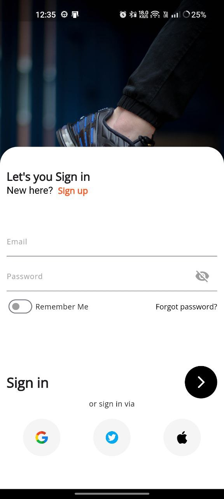
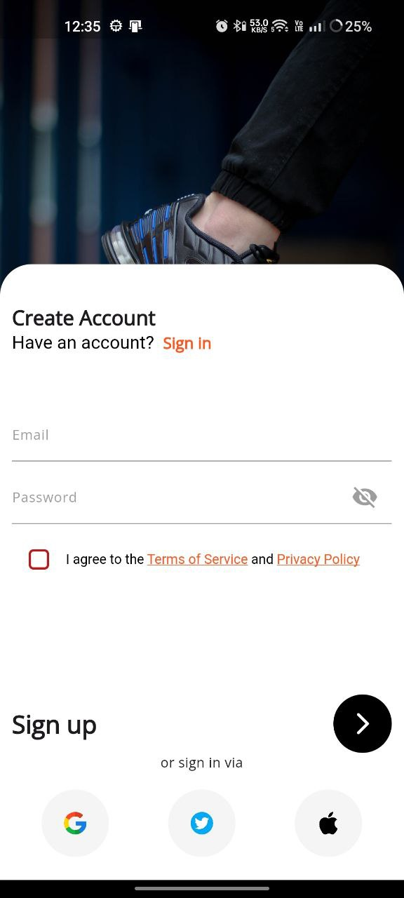
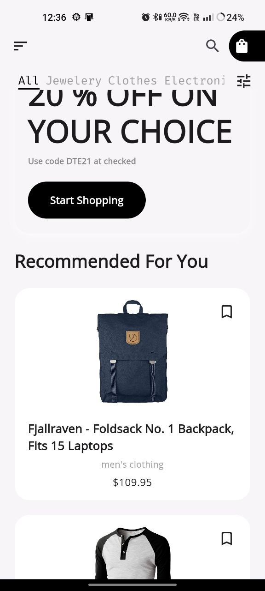
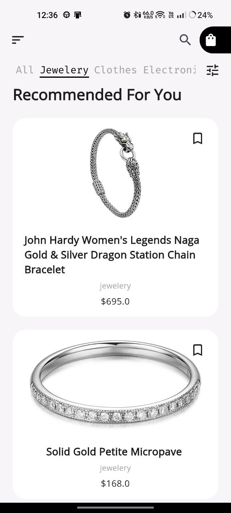
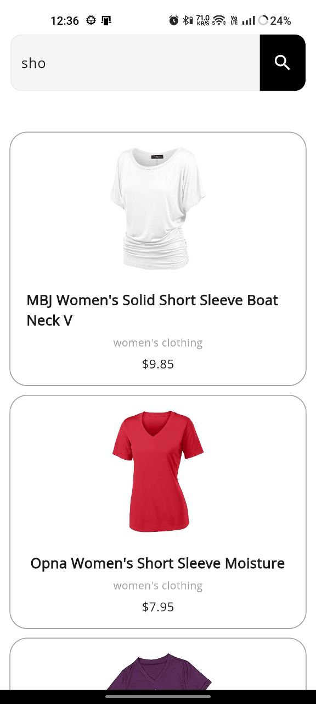
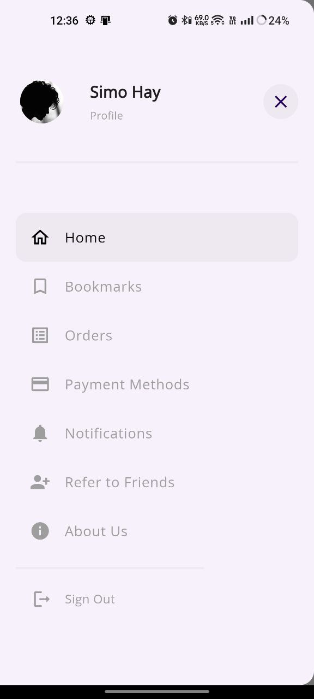
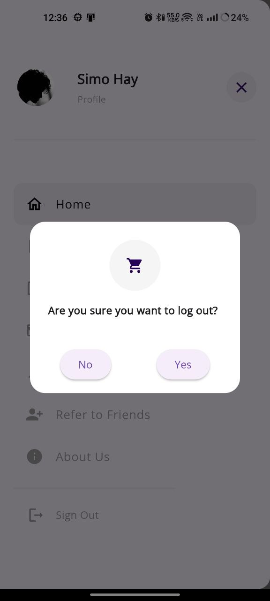

# BuyMe - Your Ultimate Ecommerce Companion

Welcome to BuyMe, a powerful and feature-rich Flutter application designed to enhance your online shopping experience. Whether you're a shopaholic or just looking for a convenient way to make purchases, BuyMe has got you covered.

## Features

- **User-Friendly Interface:** BuyMe offers a clean and intuitive interface, making it easy for users to navigate and find their favorite products effortlessly.

- **Product Categories:** Explore a wide range of products categorized for easy navigation. From electronics to fashion, BuyMe has it all.

- **Secure Transactions:** Your security is our top priority. BuyMe ensures that all your transactions are secure, providing a worry-free shopping experience.

- **Wishlist:** Save your favorite items to the wishlist for future reference. Never miss out on the products you love.

- **Order Tracking:** Keep tabs on your orders with real-time tracking. Know exactly when your purchases will arrive.

- **Promotions and Discounts:** Stay informed about the latest promotions and discounts. Save money while enjoying the thrill of shopping.

## Screenshots

  
  
  

  
  
  

  
  <!-- Add more screenshots as needed -->

## Video Demo

[![Watch the video]]https://github.com/Mashi-91/buy_me/assets/56748946/7966406b-1c32-49eb-844f-aa8c178e56fc

